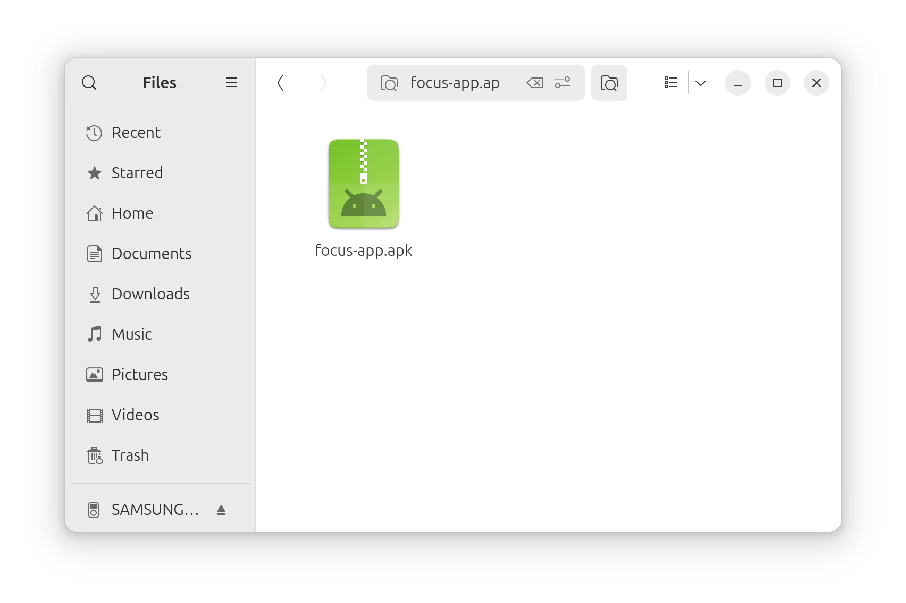
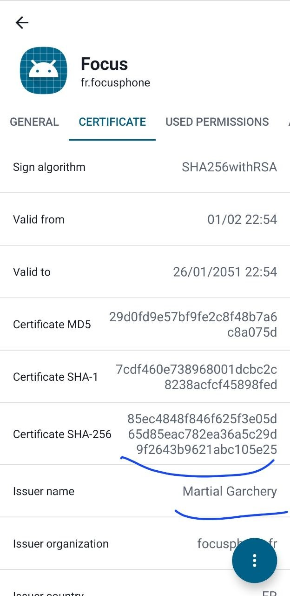
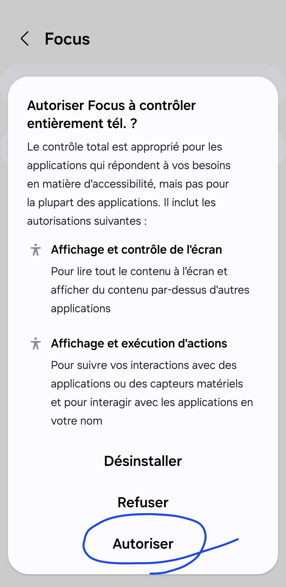
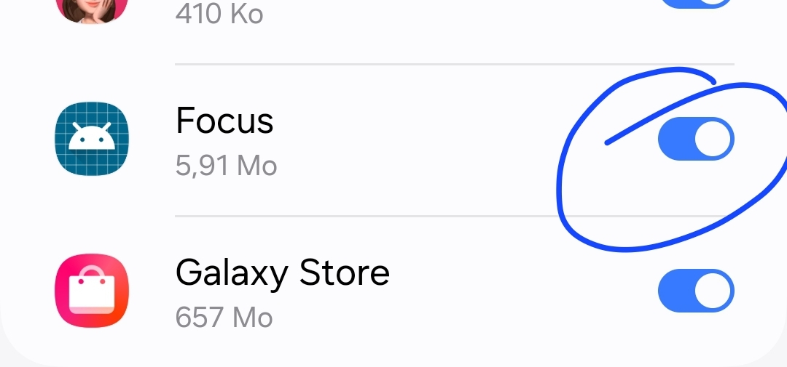

# Focus Phone

## Block Shorts everywhere they are

If a short is detected for 5 seconds straight, the phone is blocked: you have to wait a delay for the blocking overlay to disappear and to be able to use your phone again and FOCUS on something else than trash content.

**Works accross multiple apps**

- chrome, vivaldi, firefox : working
- youtube app: working
- telegram in-app browser: seem to work as well !

## How to verify this APK

Download the latest APK file [release](https://github.com/mlgarchery/focus/releases).

To ensure this app is safe and authentic, you can verify the file integrity and developer signature using the following steps:

**Step 1: Verify File Integrity (Does the file match?)**
Compare the downloaded file against the provided sha256 checksum on the release page.

macOS/Linux: `sha256sum focus-app.apk`
Windows: `Get-FileHash .\focus-app.apk -Algorithm SHA256`
If the string matches with the sha256 checksum, the download is perfect.

**Step 2: Verify Authenticity (Did the developer sign this?)**
Install [Apk Analyzer](https://play.google.com/store/apps/details?id=sk.styk.martin.apkanalyzer&pcampaignid=web_share) on your Android. Put the .apk file on you phone and analyze it. Check that the Issuer name is `Martial Garchery` and more importantly that one of the Certificates hashes among MD5, SHA-1 or SHA-256 matches one of these (remove ':' and initial '0' when comparing):

- MD5: 29:D0:FD:9E:57:BF:9F:E2:C8:F4:8B:7A:6C:8A:07:5D
- SHA1: 7C:DF:46:0E:73:89:68:00:1D:CB:C2:C8:23:8A:CF:CF:45:89:8F:ED
- SHA-256: 08:5E:C4:84:8F:84:6F:62:5F:3E:05:D6:5D:85:EA:C7:82:EA:36:A5:C2:9D:9F:26:43:B9:62:1A:BC:10:5E:25

If it matches, the app is 100% genuine.

(If you have the Android SDK installed, you can use apksigner: `apksigner verify --print-certs app-release.apk` instead of using the Apk Analyzer app)

## Installation

This app requires high privileged permissions to function.

Put the verified APK on your phone and install it. Google will display a warning and ask you to scan it, continue with installation without scan.

Then once you launch the app you have two buttons directing you to the permissions to accept:

1. Permission to read other apps content (accessibility service)
   

2. Permission to display overlays on top of other apps
   

## More

The detection can be improved, _for sure_.
Other services relying on doom-scrolling will be detected in the future.
